# InsightBestAI

## 📌 Overview

**InsightBestAI** is an AI-powered tool that streamlines financial risk analysis for professionals. Instead of manually reading through hundreds of pages of reports, articles, blogs, and PDFs, this platform scans and summarizes all relevant sources on the internet using advanced LLMs.

Whether you're an investor, analyst, or ESG-focused stakeholder, InsightBestAI helps you focus on decisions—not data gathering.

🔗 **Live App**: [Try InsightBestAI on Streamlit](https://financial-risk-assessment-reporting-prthm2910.streamlit.app/)

---

## 🚀 Features

* 🔍 **Financial Risk Analysis (Credit Risk, Operational Risk, Compliance Risk, Strategic Risk)**
* ♻️ **ESG Insights (Environmental, Social, Governance)**
* 🌐 **Force-Directed Network Graph** showing risk interdependencies
* 🧠 Powered by Google's Gemini 2.5 Flash with grounded search

---

## 🧱 Tech Stack

### Backend

* FastAPI
* LangGraph
* LangChain
* Gemini 2.5 Flash (via Gemini API)
* Pydantic

### Frontend

* Streamlit
* streamlit-searchbox

### External Services

* Google Gemini API with grounded web search

---

## 🧠 Multi-Agent Architecture Overview

The architecture behind **InsightBestAI** is designed as a modular multi-agent system built on top of LangGraph, Streamlit, and Google Gemini 2.5. It executes three intelligent agents in a coordinated flow, enabling robust, explainable, and structured analysis of financial and ESG risks, along with knowledge graph generation.

---
## 🔄 Architecture Diagram


---

## 🎯 Input

The user provides a **listed company name** through a simple Streamlit UI.

---

## 🛠️ Agent Responsibilities & Workflow

### 1. 🔍 Financial Risk Assessment Agent (`risk_reporter.py`)

**Purpose:** Evaluates the financial health and vulnerabilities of a company.

**Categories Analyzed:**

- Credit Risk
- Operational Risk
- Strategic Risk
- Compliance Risk

**Powered By:** Gemini 2.5 Flash + ReAct agent + grounded web search

**Output:** For each risk category, the agent generates:

- `risk_title`
- `description`
- `severity` (High, Medium, Low)
- `impact` and `mitigation`
- Citations with URLs

🧩 This is the foundational agent whose structured risk outputs are used later for graph generation.

---

### 2. ♻️ ESG Reporting Agent (`esg_reporting.py`)

**Purpose:** Produces ESG (Environmental, Social, Governance) insights.

**Execution:** Runs three parallel threads for each ESG dimension.

**Powered By:** Gemini 2.5 Flash + ReAct agent + grounded web search

**Output Per Category:**

- ESG category
- Rich narrative ESG description
- List of source citations

📚 Helps users understand a company's sustainability, ethics, and governance profile using reliable, cited data.

---

### 3. 🌐 Knowledge Graph Generator (`knowledge_graph.py`)

**Purpose:** Builds a **force-directed dependency graph** showing logical interconnections among the financial risks.

**Input:** Uses the textual descriptions produced by the Financial Risk Agent.

**Powered By:** Gemini 2.5 Pro with structured output parsing

**Output Schema:**

- `nodes`: Each node represents a unique risk (with `id`, `name`, `description`)
- `links`: Directed edges showing how risks influence or depend on each other

🔗 Enables users to visualize and understand how risks are semantically related.

---

## 🔄 Execution Flow

```mermaid
flowchart TD
    A[🏢 Company Name Input] --> B[🔍 Financial Risk Agent]
    A --> C[♻️ ESG Risk Agent]
    B --> D[🌐 Knowledge Graph Agent]
    B --> E[📊 Risk Table Output]
    C --> F[📘 ESG Report Output]
    D --> G[📡 Force-Directed Graph Output]
```


---

## 📽️ Demo Video

[](https://youtu.be/zUURQq8JK6s)


---

## ⚙️ Getting Started

### 1. Install Dependencies

Make sure you have Python installed. Then run:

```bash
uv sync  
```

### 2. Start Backend (FastAPI)

```bash
uv run uvicorn agents.main:app --reload
```

### 3. Start Frontend (Streamlit UI)

```bash
uv run streamlit run ui.py
```

---

## 🔧 Usage

### Input

* Type a listed company name into the search bar

### Output

* 🔹 Financial Risks
* 🔹 ESG Metrics & Insights
* 🔹 Force-Directed Graph of risk category dependencies

---

## ⚠️ Known Limitations

* ⏳ Output generation may take time due to Gemini's strict rate limits
* 🧾 Markdown rendering inconsistencies due to  Streamlit's internal markdown parsing force-directed graph explanation box

---

## 🧭 Future Improvements

* ⚡ Improve performance with Gemini Pro (paid tier)
* 🔗 Add support for Gemini URL-context for more grounded and document-specific analysis  
* 🔝 Upgrading to the paid tier also helps overcome rate limit restrictions and results in more accurate, grounded outputs.

---
